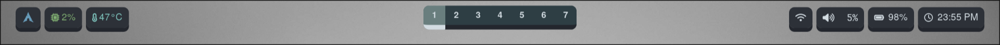
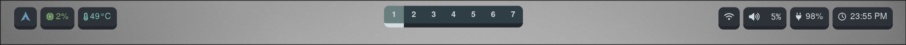

this config use next fonts: JetBrains Mono, JetBrains Mono Bold,
Symbols Nerd Font, Font Awesome.

this config use next utils: dunst, libnotify, jq, rofi-wayland

to create the calendar, move rofi catalog to ~/.config
